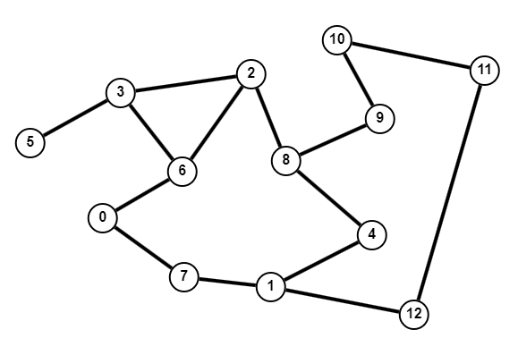

# Menor caminho em um grafo não valorado

## Explicação

Encontrar o menor caminho entre um vértice de origem e todos os outros vértices de um grafo não valorado é um problema que pode ser resolvido através do algortimo de _breadth-first search_.

A abordagem se baseia em visitar os vértices adjacentes ao vértice de origem, depois visitar os adjacentes a esses e assim sucessivamente. A busca é feita em camadas, isto é, processamos todos os vértices das menores profundidades (_depth_). Cada camada de busca corresponde a um movimento - a distância mínima possível entre o vértice que está sendo visitado e a origem (considerando que cada aresta tem peso 1).

No algoritmo, a distância entre o vértice de origem e cada um dos vértices do grafo será armazenada em um array de inteiros `dist[]`. Como inicialmente não sabemos as distâncias, iremos definir todas como `-1`. Armazenaremos a distância até cada vértice `v` em `dist[v]` (onde `v` é o número do vértice). É importante lembrar que a distância até a origem é sempre 0.

Além disso, para cada vértice processado, iremos adicioná-lo à uma fila (_queue_), que prioriza os primeiros vértices adicionados. Dessa forma, é possível manter a ordem correta para fazer a travessia do grafo.

Para evitar que um vértice seja processado mais de uma vez (e possivelmente gerar um ciclo infinito), iremos também definir um array booleano `visitado[]`, inicializado inteiramente como `false`. Ao processar um vértice `v`, marcaremos `visitado[v]` como `true`. Assim, somente os vértices não visitados serão processados.

Durante o funcionamento, para cada vértice `v` (com exceção do vértice de origem), iremos chegar até este a partir de outro vértice `u` (se existir um caminho possível entre `u` e `v`), portanto, a distância até `v` será a distância da origem até `u` + 1.

$$
u \to v \implies dist[v] = dist[u] + 1
$$

No fim, teremos o array definido com todas as distâncias e, as distâncias que estiverem ainda como `-1` indicam que aquele vértice não é conexo com o vértice de origem. Assim, podemos verificar a menor distância entre o vértice de origem e qualquer outro vértice do grafo em tempo constante.

Abaixo está um exemplo de um grafo e a visualização do funcionamento do algoritmo em questão, com o vértice de origem sendo o número 0.

<figure><figcaption><p>Grafo de exemplo.</p></figcaption></figure>

<figure><figcaption><p>Funcionamento do algoritmo, determinando a menor distância até cada vértice.</p></figcaption></figure>

## Implementação



```cpp
#include <iostream>
#include <vector>
#include <queue>
using namespace std;

// Número de vértices do grafo de exemplo
const int V = 13;

// Lista de adjacências do grafo de exemplo
vector<vector<int>> adj{
    {6,7},  // 0->6, 0->7
    {7,4,12},  // 1->7, 1->4, 1->12
    {3,6,8},  // 2->3, 2->6, 2->8
    {5,6,2},  // ...
    {1,8},
    {3},
    {0,3,2},
    {0,1},
    {2,9,4},
    {8,10},
    {9,11},
    {10,12},
    {1,11}
};

// Array para armazenar a distância entre
// o vértice de origem e os outros vértices.
vector<int> dist(V);

// Função para calcular a distância entre o vértice
// 'origem' e os outros vértices do grafo.
void bfs(int origem) {
    // Definir a distância até os outros vértices como -1
    fill(dist.begin(), dist.end(), -1);

    // A distância entre a origem e a própria origem é 0
    dist[origem] = 0;

    // Array de vértices visitados
    // (todos os elementos inicializados como false).
    vector<bool> visitado(V);
    // Definir o vértice de origem como 'visitado'
    visitado[origem] = true;

    // Fila para armazenar as adjacências de cada vértice processado
    queue<int> fila;
    // Adicionar o vértice de origem à fila
    fila.push(origem);

    // Iteração para cada vértice na fila
    while (!fila.empty()) {
        // Pegar o último vértice
        int u = fila.front();
        // Removê-lo da fila
        fila.pop();

        // Iteração para cada vértice adjacente à u
        for (auto v : adj[u]) {
            // Se o vértice v ainda não foi visitado
            if (!visitado[v]) {
                // Definir o vértice como 'visitado'
                visitado[v] = true;

                // Adicioná-lo à fila
                fila.push(v);

                // Definir a distância até esse vértice
                // (distância até o vértice u + 1).
                dist[v] = dist[u] + 1;
            }
        }
    }
}

int main() {
    bfs(0);
    // dist[] = {0, 2, 2, 2, 3, 3, 1, 1, 3, 4, 5, 4, 3}

    bfs(5);
    // dist[] = {3, 5, 2, 1, 4, 0, 2, 4, 3, 4, 5, 6, 6}

    bfs(8);
    // dist[] = {3, 2, 1, 2, 1, 3, 2, 3, 0, 1, 2, 3, 3}


    return 0;
}
```



```python
# A classe deque possui estrutura e métodos para
# o contexto FIFO (First In, First Out), servindo
# como uma queue mais eficiente que uma lista padrão do Python.
from collections import deque

# Número de vértices do grafo de exemplo
V = 13

# Lista de adjacências do grafo de exemplo
adj = [
    [6,7],  # 0->6, 0->7
    [7,4,12],  # 1->7, 1->4, 1->12
    [3,6,8],  # 2->3, 2->6, 2->8
    [5,6,2],  # ...
    [1,8],
    [3],
    [0,3,2],
    [0,1],
    [2,9,4],
    [8,10],
    [9,11],
    [10,12],
    [1,11]
]

# Função para calcular a distância entre o vértice
# 'origem' e os outros vértices do grafo.
def bfs(origem: int) -> None:
    # Array para armazenar a distância entre
    # o vértice de origem e os outros vértices.
    global dist
    # Definir a distância até os outros vértices como -1
    dist = [-1 for i in range(V)]

    # A distância entre a origem e a própria origem é 0
    dist[origem] = 0

    # Lista de vértices visitados
    # (todos os elementos inicializados como False).
    visitado = [False for i in range(V)]
    # Definir o vértice de origem como 'visitado'
    visitado[origem] = True

    # Fila para armazenar as adjacências de cada vértice processado
    fila = deque()
    # Adicionar o vértice de origem à fila
    fila.append(origem)

    # Iteração para cada vértice na fila
    while fila:
        # Pegar o primeiro vértice e removê-lo da fila
        u = fila.popleft()

        # Iteração para cada vértice adjacente à u
        for v in adj[u]:
            # Se o vértice v ainda não foi visitado
            if not visitado[v]:
                # Definir o vértice como 'visitado'
                visitado[v] = True

                # Adicioná-lo à fila
                fila.append(v)

                # Definir a distância até esse vértice
                # (distância até o vértice u + 1).
                dist[v] = dist[u] + 1

bfs(0)
# dist = [0, 2, 2, 2, 3, 3, 1, 1, 3, 4, 5, 4, 3]

bfs(5)
# dist = [3, 5, 2, 1, 4, 0, 2, 4, 3, 4, 5, 6, 6]

bfs(8)
# dist = [3, 2, 1, 2, 1, 3, 2, 3, 0, 1, 2, 3, 3]
```


