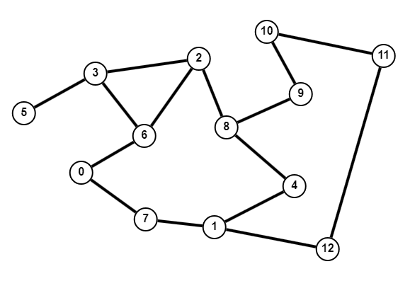

# Menor caminho em um grafo não valorado

## Explicação

Encontrar o menor caminho entre um vértice de origem e todos os outros vértices de um grafo não valorado é um problema que pode ser resolvido através do algoritmo de _breadth-first search_.

A abordagem se baseia em visitar os vértices adjacentes ao vértice de origem, depois visitar os adjacentes a esses e assim sucessivamente. A busca é feita em camadas, isto é, processamos todos os vértices das menores profundidades (_depth_). Cada camada de busca corresponde a um movimento - a distância mínima possível entre o vértice que está sendo visitado e a origem (considerando que cada aresta tem peso 1).

No algoritmo, a distância entre o vértice de origem e cada um dos vértices do grafo será armazenada em um array de inteiros `dist[]`. Como inicialmente não sabemos as distâncias, iremos definir todas como `-1`. Armazenaremos a distância até cada vértice `v` em `dist[v]` (onde `v` é o número do vértice). É importante lembrar que a distância até a origem é sempre 0.

Além disso, para cada vértice processado, iremos adicioná-lo à uma fila (_queue_), que prioriza os primeiros vértices adicionados. Dessa forma, é possível manter a ordem correta para fazer a travessia do grafo.

Para evitar que um vértice seja processado mais de uma vez (e possivelmente gerar um ciclo infinito), iremos também definir um array booleano `visited[]`, inicializado inteiramente como `false`. Ao processar um vértice `v`, marcaremos `visited[v]` como `true`. Assim, somente os vértices não visitados serão processados.

Durante o funcionamento, para cada vértice `v` (com exceção do vértice de origem), iremos chegar até este a partir de outro vértice `u` (se existir um caminho possível entre `u` e `v`), portanto, a distância até `v` será a distância da origem até `u` + 1.

$$
u \to v \implies dist[v] = dist[u] + 1
$$

No fim, teremos o array definido com todas as distâncias e, as distâncias que estiverem ainda como `-1` indicam que aquele vértice não é conexo com o vértice de origem. Assim, podemos verificar a menor distância entre o vértice de origem e qualquer outro vértice do grafo em tempo constante.

Abaixo está um exemplo de um grafo e a visualização do funcionamento do algoritmo em questão, com o vértice de origem sendo o de número 0.

<figure><figcaption><p>Grafo de exemplo.</p></figcaption></figure>

<figure><figcaption><p>Funcionamento do algoritmo, determinando a menor distância até cada vértice.</p></figcaption></figure>

## Implementação



```c
#include <stdio.h>
#include <stdlib.h>
#include <stdbool.h>
#include <string.h>

// Número de vértices do grafo de exemplo
#define V 13

// ----------------- Definição de um nodo para outras structs -----------------
typedef struct Node {
    struct Node *next;
    int val;
} Node;

// Função para criar um nodo com um determinado valor
Node *createNode(const int val) {
    Node *node = malloc(sizeof(Node));
    node->next = NULL;
    node->val = val;
    return node;
}
// --------------------------------------------------------------------------

// ----------------- Definição de uma lista de adjacência -----------------
typedef struct {
    Node **content;
    size_t size;
} AdjacencyList;

// Função para criar uma lista de adjacência para size vértices
AdjacencyList *createAdjacencyList(const size_t size) {
    AdjacencyList *adjacencyList = malloc(sizeof(AdjacencyList));
    adjacencyList->content = calloc(size, sizeof(Node*));
    adjacencyList->size = size;
    return adjacencyList;
}

// Função para adicionar uma aresta não direcionada entre dois vértices
void addEdge(const AdjacencyList *const adjacencyList, const int u, const int v) {
    Node *nodeU = createNode(u);
    Node *nodeV = createNode(v);
    nodeU->next = adjacencyList->content[v];
    nodeV->next = adjacencyList->content[u];
    adjacencyList->content[u] = nodeV;
    adjacencyList->content[v] = nodeU;
}

// Função para liberar a memória de uma lista de adjacência
void freeAdjacencyList(AdjacencyList *const adjacencyList) {
    for (size_t i = 0; i < adjacencyList->size; i++) {
        Node *cur = adjacencyList->content[i];
        while (cur != NULL) {
            Node *next = cur->next;
            free(cur);
            cur = next;
        }
    }
    free(adjacencyList->content);
    free(adjacencyList);
}
// --------------------------------------------------------------------------

// ----------------- Definição de uma fila -----------------
typedef struct {
    Node *head;
    Node *tail;
    size_t size;
} Queue;

// Função para criar uma fila
Queue *createQueue() {
    Queue *queue = calloc(1, sizeof(Queue));
    return queue;
}

// Função para retornar o valor do início da fila
int queueFront(const Queue *const queue) {
    return queue->head->val;
}

// Função para verificar se a fila está vazia
bool queueEmpty(const Queue *const queue) {
    return queue->size == 0;
}

// Função para adicionar um elemento à fila
void queuePush(Queue *const queue, const int val) {
    Node *node = createNode(val);
    if (queue->size == 0) {
        queue->head = node;
    }
    else {
        queue->tail->next = node;
    }
    queue->tail = node;
    queue->size++;
}

// Função para remover um elemento da fila
void queuePop(Queue *const queue) {
    Node *oldHead = queue->head;
    queue->head = queue->head->next;
    free(oldHead);
    queue->size--;
    if (queue->size == 0) {
        queue->tail = NULL;
    }
}

// Função para liberar a memória de uma fila
void freeQueue(Queue *const queue) {
    Node *cur = queue->head;
    while (cur != NULL) {
        Node *next = cur->next;
        free(cur);
        cur = next;
    }
    free(queue);
}
// --------------------------------------------------------------------------

// Lista de adjacência do grafo de exemplo
AdjacencyList *adj;

// Array para armazenar a distância entre
// o vértice de origem e os outros vértices.
int *dist;

// Função para calcular a distância entre o vértice
// 'origem' e os outros vértices do grafo.
void bfs(const int source) {
    // Definir a distância até os outros vértices como -1
    memset(dist, -1, V * sizeof(int));

    // A distância entre a origem e a própria origem é 0
    dist[source] = 0;

    // Array de vértices visitados
    // (todos os elementos inicializados como false).
    bool *visited = calloc(V, sizeof(bool));

    // Definir o vértice de origem como 'visitado'
    visited[source] = true;

    // Fila para armazenar as adjacências de cada vértice processado
    Queue *q = createQueue();
    // Adicionar o vértice de origem à fila
    queuePush(q, source);

    // Iteração para cada vértice na fila
    while (!queueEmpty(q)) {
        // Pegar o último vértice
        int u = queueFront(q);
        // Removê-lo da fila
        queuePop(q);

        // Iteração para cada vértice adjacente à u
        for (Node *ptr = adj->content[u]; ptr != NULL; ptr = ptr->next) {
            int v = ptr->val;
            // Se o vértice v ainda não foi visitado
            if (!visited[v]) {
                // Definir o vértice como 'visitado'
                visited[v] = true;

                // Adicioná-lo à fila
                queuePush(q, v);

                // Definir a distância até esse vértice
                // (distância até o vértice u + 1).
                dist[v] = dist[u] + 1;
            }
        }
    }
    
    // Liberar a memória utilizada
    free(visited);
    freeQueue(q);
}

int main() {
    adj = createAdjacencyList(V);
    addEdge(adj, 0, 6);  // 0<->6
    addEdge(adj, 0, 7);  // 0<->7
    addEdge(adj, 1, 4);  // 1<->4
    addEdge(adj, 1, 7);  // ...
    addEdge(adj, 1, 12);
    addEdge(adj, 2, 3);
    addEdge(adj, 2, 6);
    addEdge(adj, 2, 8);
    addEdge(adj, 3, 5);
    addEdge(adj, 3, 6);
    addEdge(adj, 4, 8);
    addEdge(adj, 8, 9);
    addEdge(adj, 9, 10);
    addEdge(adj, 10, 11);
    addEdge(adj, 11, 12);

    dist = malloc(V * sizeof(int));

    bfs(0);
    // dist[] = {0, 2, 2, 2, 3, 3, 1, 1, 3, 4, 5, 4, 3}

    bfs(5);
    // dist[] = {3, 5, 2, 1, 4, 0, 2, 4, 3, 4, 5, 6, 6}

    bfs(8);
    // dist[] = {3, 2, 1, 2, 1, 3, 2, 3, 0, 1, 2, 3, 3}

    // Liberar a memória utilizada
    freeAdjacencyList(adj);
    free(dist);

    return 0;
}
```



```cpp
#include <iostream>
#include <vector>
#include <queue>
using namespace std;

// Número de vértices do grafo de exemplo
const int V = 13;

// Lista de adjacência do grafo de exemplo
vector<vector<int>> adj{
    {6,7},  // 0->6, 0->7
    {7,4,12},  // 1->7, 1->4, 1->12
    {3,6,8},  // 2->3, 2->6, 2->8
    {5,6,2},  // ...
    {1,8},
    {3},
    {0,3,2},
    {0,1},
    {2,9,4},
    {8,10},
    {9,11},
    {10,12},
    {1,11}
};

// Array para armazenar a distância entre
// o vértice de origem e os outros vértices.
vector<int> dist(V);

// Função para calcular a distância entre o vértice
// 'origem' e os outros vértices do grafo.
void bfs(const int source) {
    // Definir a distância até os outros vértices como -1
    fill(dist.begin(), dist.end(), -1);

    // A distância entre a origem e a própria origem é 0
    dist[source] = 0;

    // Array de vértices visitados
    // (todos os elementos inicializados como false).
    vector<bool> visited(V);
    // Definir o vértice de origem como 'visitado'
    visited[source] = true;

    // Fila para armazenar as adjacências de cada vértice processado
    queue<int> q;
    // Adicionar o vértice de origem à fila
    q.push(source);

    // Iteração para cada vértice na fila
    while (!q.empty()) {
        // Pegar o último vértice
        int u = q.front();
        // Removê-lo da fila
        q.pop();

        // Iteração para cada vértice adjacente à u
        for (auto v : adj[u]) {
            // Se o vértice v ainda não foi visitado
            if (!visited[v]) {
                // Definir o vértice como 'visitado'
                visited[v] = true;

                // Adicioná-lo à fila
                q.push(v);

                // Definir a distância até esse vértice
                // (distância até o vértice u + 1).
                dist[v] = dist[u] + 1;
            }
        }
    }
}

int main() {
    bfs(0);
    // dist[] = {0, 2, 2, 2, 3, 3, 1, 1, 3, 4, 5, 4, 3}

    bfs(5);
    // dist[] = {3, 5, 2, 1, 4, 0, 2, 4, 3, 4, 5, 6, 6}

    bfs(8);
    // dist[] = {3, 2, 1, 2, 1, 3, 2, 3, 0, 1, 2, 3, 3}


    return 0;
}
```



```python
# A classe deque possui estrutura e métodos para
# o contexto FIFO (First In, First Out), servindo
# como uma queue mais eficiente que uma lista padrão do Python.
from collections import deque

# Número de vértices do grafo de exemplo
V = 13

# Lista de adjacência do grafo de exemplo
adj = [
    [6,7],  # 0->6, 0->7
    [7,4,12],  # 1->7, 1->4, 1->12
    [3,6,8],  # 2->3, 2->6, 2->8
    [5,6,2],  # ...
    [1,8],
    [3],
    [0,3,2],
    [0,1],
    [2,9,4],
    [8,10],
    [9,11],
    [10,12],
    [1,11]
]

# Função para calcular a distância entre o vértice
# 'origem' e os outros vértices do grafo.
def bfs(source: int) -> None:
    # Array para armazenar a distância entre
    # o vértice de origem e os outros vértices.
    global dist
    # Definir a distância até os outros vértices como -1
    dist = [-1 for i in range(V)]

    # A distância entre a origem e a própria origem é 0
    dist[source] = 0

    # Lista de vértices visitados
    # (todos os elementos inicializados como False).
    visitado = [False for i in range(V)]
    # Definir o vértice de origem como 'visitado'
    visitado[origem] = True

    # Fila para armazenar as adjacências de cada vértice processado
    fila = deque()
    # Adicionar o vértice de origem à fila
    fila.append(origem)

    # Iteração para cada vértice na fila
    while fila:
        # Pegar o primeiro vértice e removê-lo da fila
        u = fila.popleft()

        # Iteração para cada vértice adjacente à u
        for v in adj[u]:
            # Se o vértice v ainda não foi visitado
            if not visitado[v]:
                # Definir o vértice como 'visitado'
                visitado[v] = True

                # Adicioná-lo à fila
                fila.append(v)

                # Definir a distância até esse vértice
                # (distância até o vértice u + 1).
                dist[v] = dist[u] + 1

bfs(0)
# dist = [0, 2, 2, 2, 3, 3, 1, 1, 3, 4, 5, 4, 3]

bfs(5)
# dist = [3, 5, 2, 1, 4, 0, 2, 4, 3, 4, 5, 6, 6]

bfs(8)
# dist = [3, 2, 1, 2, 1, 3, 2, 3, 0, 1, 2, 3, 3]
```


