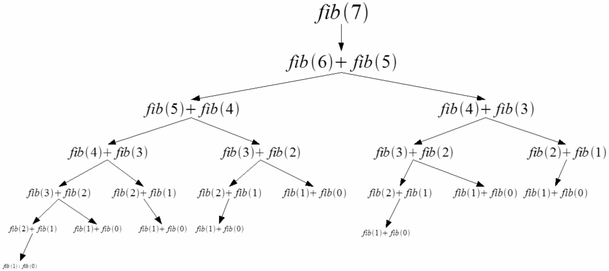

# Generalização

## Explicação

Programação dinâmica é uma técnica de resolução e otimização, onde o problema principal é decomposto em um conjunto de subproblemas menores que são utilizados como base para encontrar uma resposta ótima para o problema principal.

### Calculando números de Fibonacci

Tomemos como exemplo a famosa **Sequência de Fibonacci**. Nessa sequência, começamos pelos dois primeiros termos: 0 e 1, e a partir destes, cada número será a soma dos dois termos anteriores. Abaixo estão os 10 primeiros números dessa sequência.

$$
0,\ 1,\ 1,\ 2,\ 3,\ 5,\ 8,\ 13,\ 21,\ 34, \dots
$$

Considere `fib(n)` uma função que retorna o enésimo (0-indexado) número da Sequência de Fibonacci. Sendo assim, por definição:

$$
fib(n)  = \begin{cases}
  0 & \text{se } n=0 \\
  1 & \text{se } n=1 \\
  fib(n-2) + fib(n-1) & \text{se } n > 1
\end{cases}
$$

Para calcular `fib(7)`, por exemplo, seria necessário calcular `fib(m)` para todo `m <= 7`. Abaixo está uma visualização da árvore recursiva de `fib(7)`.

<figure><figcaption><p>Árvore recursiva de Fibonacci. Fonte: <a href="https://en.wikipedia.org/wiki/File:FibbonacciRecurisive.png">https://en.wikipedia.org/wiki/File:FibbonacciRecurisive.png</a></p></figcaption></figure>

Para chegarmos ao resultado final, é preciso dividir o problema em diversos problemas menores. Para todo `m <= 7` (com exceção do casos base 0 e 1) são calculadas duas funções que definem o resultado da função inicial. O fator de multiplicação do número de chamadas recursivas em função de `n` é exponencial, portanto, em termos de complexidade de tempo, `fib(n)`, neste exemplo, é calculado em O(2^n).

### Memorizando cálculos

Ainda considerando a árvore recursiva acima, perceba que diversas funções são calculadas mais de uma vez. Como dito anteriormente, a complexidade de tempo para calcular `fib(n)` é exponencial, pois cada função "chama" mais duas funções. Para otimizar esse problema e evitar recálculos, podemos armazenar o resultado de `fib(x)` (para qualquer número `x`) em um array `dp[]`\* na posição `x`. Dessa forma, antes de chamar as funções que definem `fib(x)`, verificamos se `dp[x]` já foi calculado. Em caso positivo, simplesmente retornamos o resultado, caso contrário, chamamos as funções para que o valor para `fib(x)` seja calculado. Com isso, a complexidade de tempo cai de O(2^n) para O(n).

\* `dp` é um nome comum utilizado para nomear o array de memorização em problemas de PD.

## PD Top-down

A abordagem _Top-down_ se baseia em: começar pelo problema maior e recursivamente calcular os subproblemas menores. Essa é a abordagem do exemplo acima, onde é gerada uma árvore recursiva.

### Implementação



```cpp
#include <iostream>
#include <vector>
using namespace std;

// Limite arbitrário de exemplo
int N = 10;

// Array de memorização
vector<int> dp(N);

// Array para verificar se um estado
// arbitrário da dp já foi calculado.
vector<bool> calculado(N);

// Função recursiva para calcular os números de fibonacci de 0 até N-1
int fib(int n) {
    // Se o estado n da dp já foi calculado
    if (calculado[n]) {
        // Retornar o estado n da dp
        return dp[n];
    }

    // Definir o estado n da dp como a soma dos estados n-2 e n-1
    dp[n] = fib(n-2) + fib(n-1);

    // Definir o estado n como 'calculado'
    calculado[n] = true;

    // Retornar o estado n da dp
    return dp[n];
}

int main() {
    dp[0] = 0;  // Caso base: fib(0) = 0
    dp[1] = 1;  // Caso base: fib(1) = 1
    calculado[0] = true;
    calculado[1] = true;

    // Chamar a função para o último estado da dp (limite)
    fib(N-1);

    // dp[] = {0, 1, 1, 2, 3, 5, 8, 13, 21, 34}

    return 0;
}
```



```python
# Limite arbitrário de exemplo
N = 10

# Lista de memorização
dp = [0 for i in range(N)]

# Lista para verificar se um estado
# arbitrário da dp já foi calculado.
calculado = [False for i in range(N)]

# Função recursiva para calcular os números de fibonacci de 0 até N-1
def fib(n: int) -> int:
    # Se o estado n da dp já foi calculado
    if calculado[n]:
        # Retornar o estado n da dp
        return dp[n]

    # Definir o estado n da dp como a soma dos estados n-2 e n-1
    dp[n] = fib(n-2) + fib(n-1)

    # Definir o estado n como 'calculado'
    calculado[n] = True

    # Retornar o estado n da dp
    return dp[n]

dp[0] = 0  # Caso base: fib(0) = 0
dp[1] = 1  # Caso base: fib(1) = 1
calculado[0] = True
calculado[1] = True

# Chamar a função para o último estado da dp (limite)
fib(N-1)

# dp[] = [0, 1, 1, 2, 3, 5, 8, 13, 21, 34]
```



## PD Bottom-up

A abordagem _Bottom-up_ se baseia em: começar pelos subproblemas menores, para no final responder o problema maior. Ainda no exemplo da Sequência de Fibonacci, começamos calculando o segundo termo, que só depende dos dois casos base: 0 e 1. Assim, cada número é calculado de forma sequencial, tendo como base os termos previamente calculados.

### Implementação



```cpp
#include <iostream>
#include <vector>
using namespace std;

// Limite arbitrário de exemplo
int N = 10;

// Array de tabulação
vector<int> dp(N);

int main() {
    dp[0] = 0;  // Caso base: fib(0) = 0
    dp[1] = 1;  // Caso base: fib(1) = 1

    // Iteração para cada estado da dp (com exceção dos casos base)
    for (int i = 2; i < N; i++) {
        // O i-ésimo estado da dp (i-ésimo número de fibonacci)
        // é a soma dos dois estados anteriores.
        dp[i] = dp[i-2] + dp[i-1];
    }

    // dp[] = {0, 1, 1, 2, 3, 5, 8, 13, 21, 34}

    return 0;
}
```



```python
# Limite arbitrário de exemplo
N = 10

# Lista de tabulação
dp = [0 for i in range(N)]

dp[0] = 0  # Caso base: fib(0) = 0
dp[1] = 1  # Caso base: fib(1) = 1

# Iteração para cada estado da dp (com exceção dos casos base)
for i in range(2, N):
    # O i-ésimo estado da dp (i-ésimo número de fibonacci)
    # é a soma dos dois estados anteriores.
    dp[i] = dp[i-2] + dp[i-1]

# dp[] = [0, 1, 1, 2, 3, 5, 8, 13, 21, 34]
```


